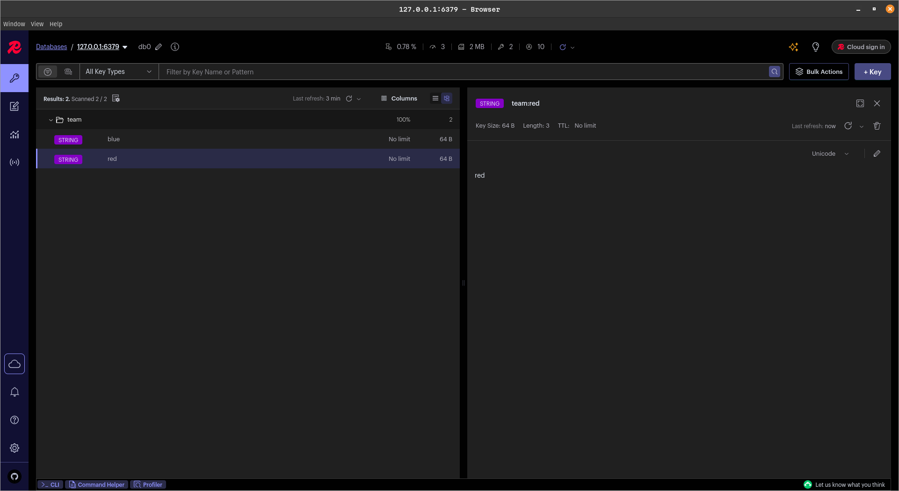
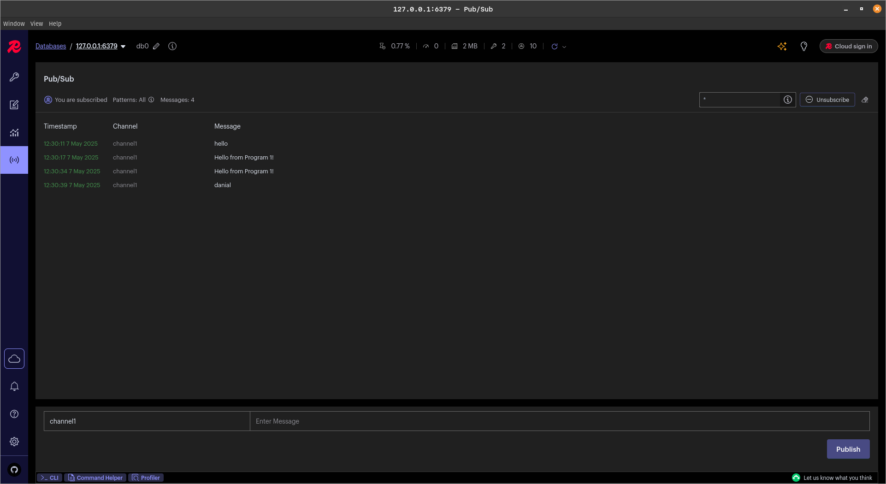

# Redis

## (a)

### (i)

```bash
docker build -t my_redis_server .
```

- `-t` : Name and optionally a tag in the 'name:tag' format. If you omit the tag, it defaults to 'latest'.

```bash
docker run -d --name redis_server -p 6379:6379 my_redis_server
```

- `-d` : Run container in detached mode (in the background).

- `--name` : Assign a name to the container.

- `-p` : Publish a container's port to the host.

### (ii)

```bash
docker exec -it redis_server redis-cli
```

```bash
PING

# Respond:
PONG  
```

## (b)

### (i)

[1.py](./1.py)  
[2.py](./2.py)

### (ii)

#### (a)

```python
# Set multiple key-value pairs
r.set("key1", "value1")
r.set("key2", "value2")
```

#### (b)

```python
# Publish messages to a Redis channel
r.publish("channel1", "Hello from Program 1!")
print("Messages published and keys set.")
```

### (iii)

#### (a)

```python
# Retrieve and display key-value pairs
print("key1:", r.get("key1"))
print("key2:", r.get("key2"))
```

#### (b)

```python
# Subscribe to the Redis channel
pubsub = r.pubsub()
pubsub.subscribe("channel1")

print("Subscribed to channel1. Waiting for messages...")
for message in pubsub.listen():
    if message["type"] == "message":
        print(f"Received message: {message['data']}")
```

## (c)

### (i)

### (ii)




